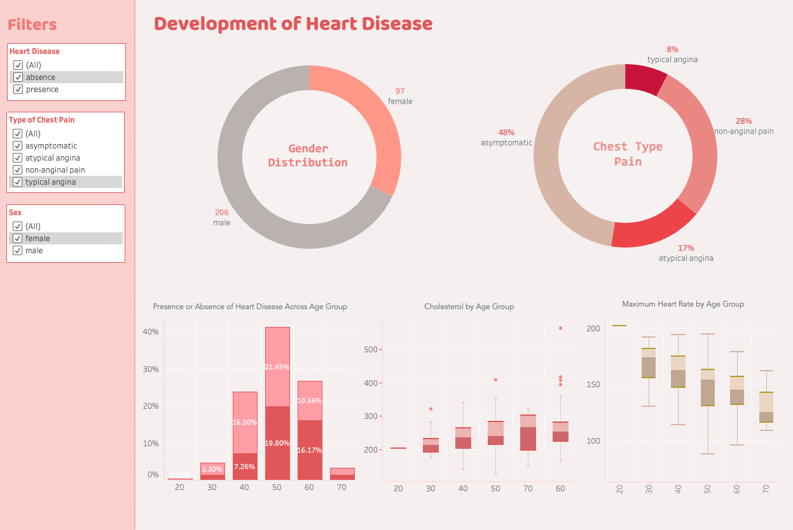

# Heart Disease Dashboard

> Author: Jenny Lee (@jlee2843)

## Motivation
> **Target audience**: Health care professionals 

Heart disease poses a significant threat to individuals worldwide, affecting approximately 1 in 20 adults aged 20 and older (about 5%). Numerous factors contribute to its development, including age, gender, type and frequency of chest pain, maximum heart rate, and cholesterol levels. This dashboard is designed to assist healthcare professionals in understanding the impact of these factors on the likelihood of developing heart disease in patients. By providing clear visualizations, it enables professionals to gain insights into key risk factors and make informed decisions regarding patient care and prevention strategies.

## Walkthrough Video

## Disclaimer
Since this project is created in Tableau, I did not require any python file dedicated to run the program locally. Therefore, there is no `src` folder or `environment.yml` file that are required to run the file locally. 
